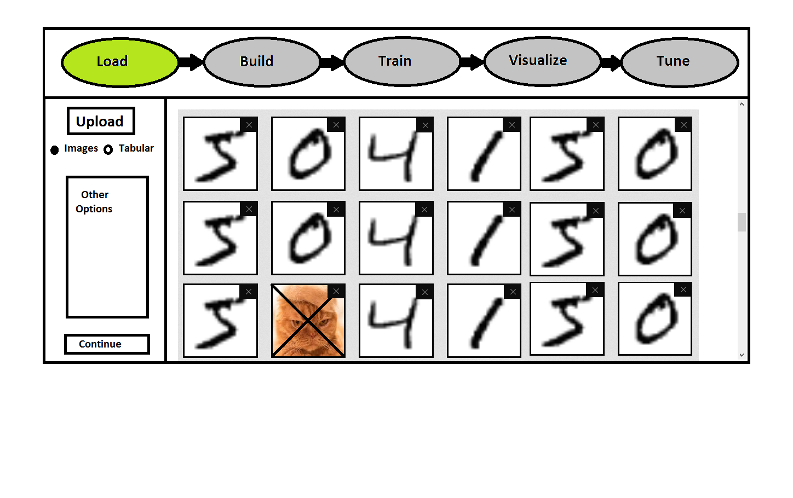
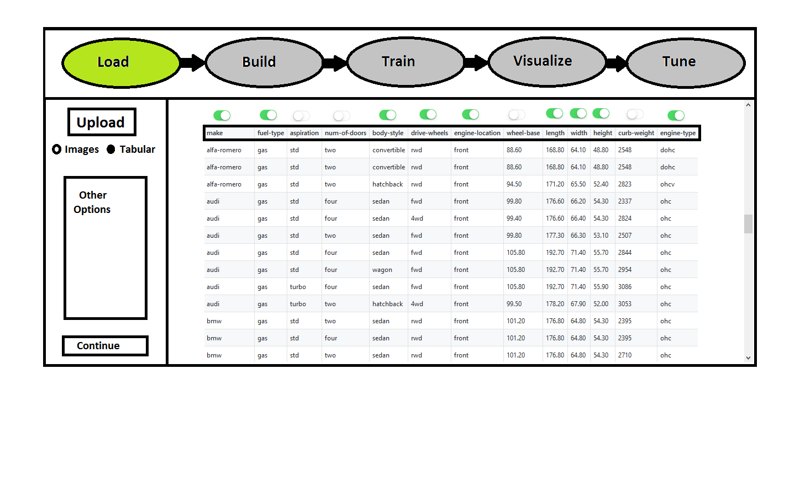
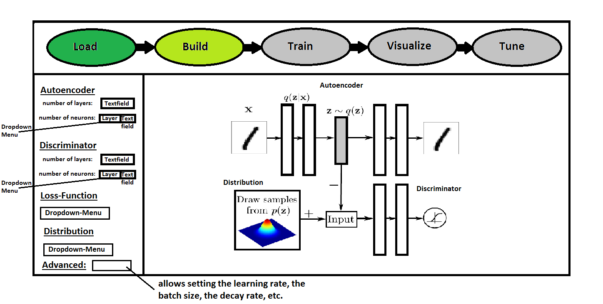
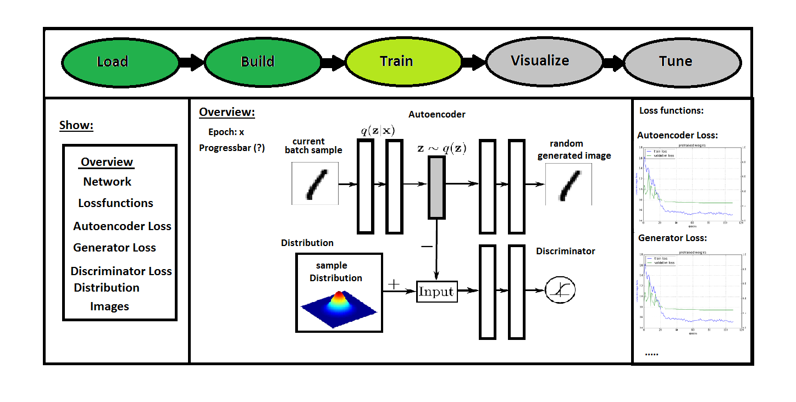
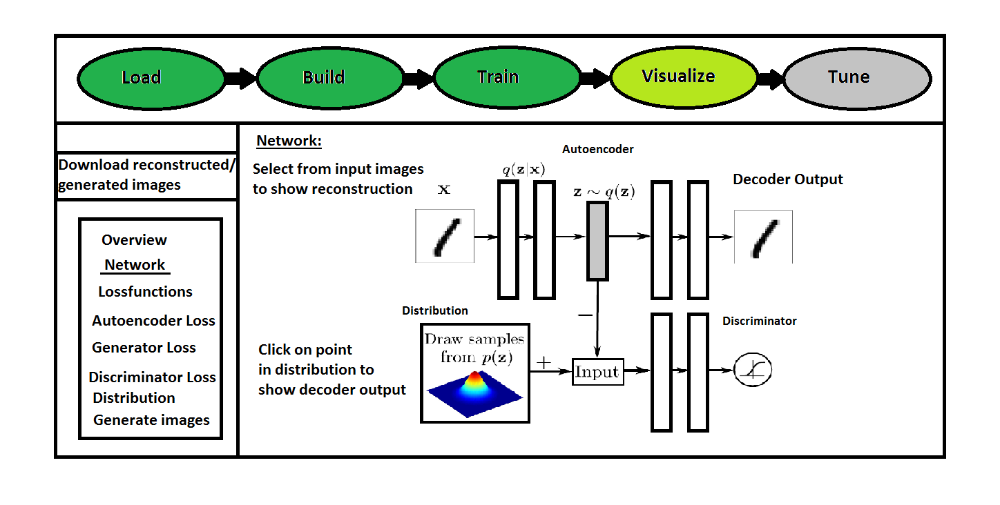
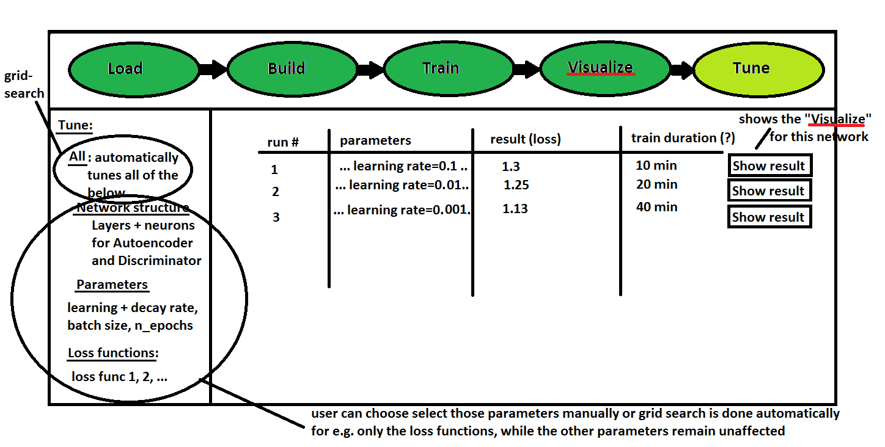

# Adversarial Autoencoder

User Interface will have those "steps":

    1. load — images or tabular data 
    2. build — image of the network which interactively builds
    3. train — image of network, with input and output from auto-encoder at x number of iterations 
    plus you see the real distribution updates over time. Then of course show the loss function graphs 
    in real-time.
    4. visualize — image of network, with ability to draw samples to generate, and to see strip of 
    images or observations that you can select in order to see the decoder
    5. tune — setting up grid search, and returning a list of panels, and on each panel you have 
    parameters with over all loss

## UI sketches: 

### Load images

### Load tabular data

### Build network

### Train network

### Visualize results

### Tune parameters

